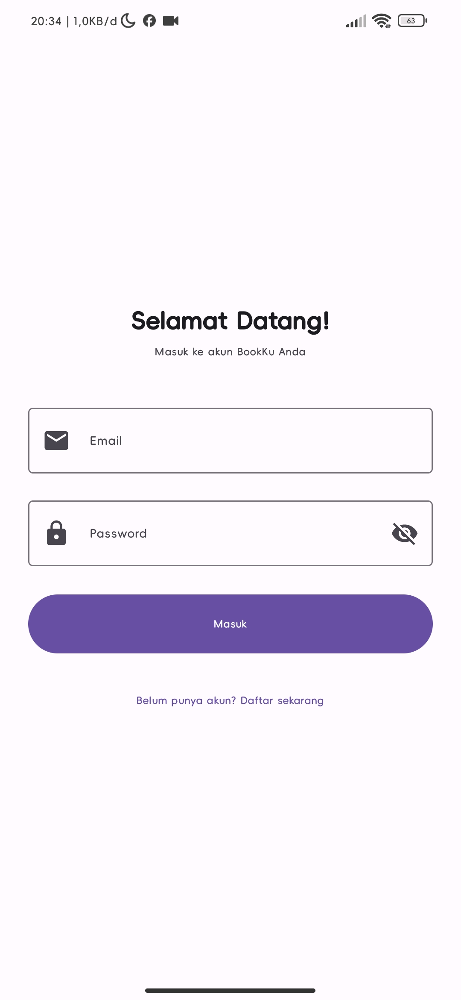
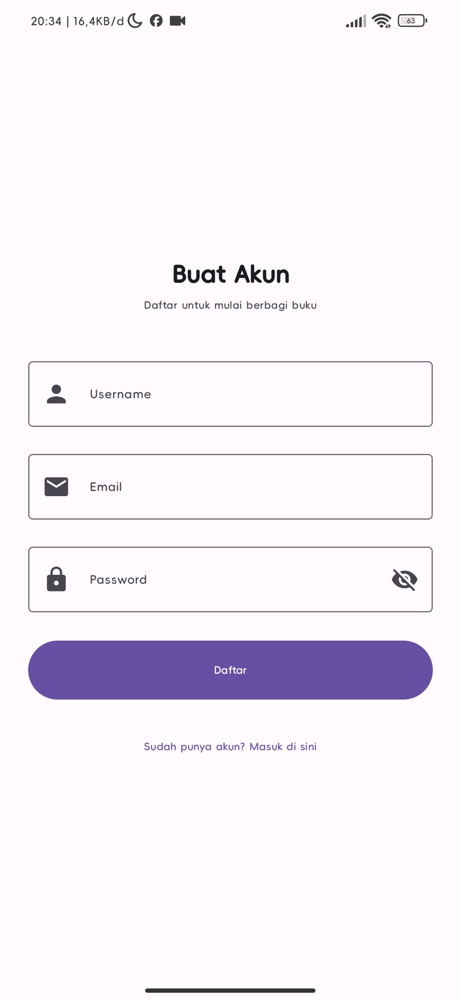
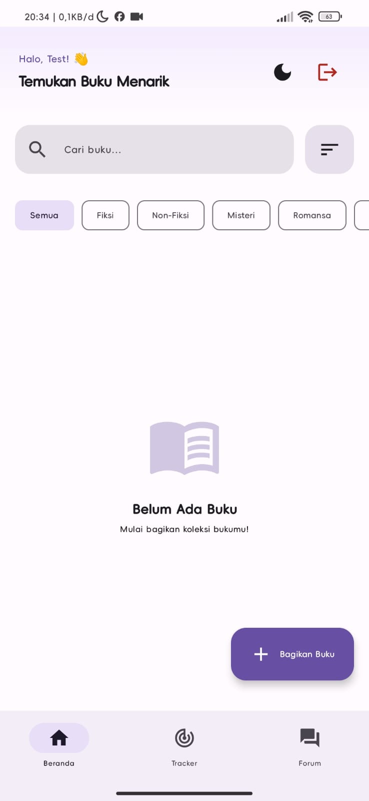
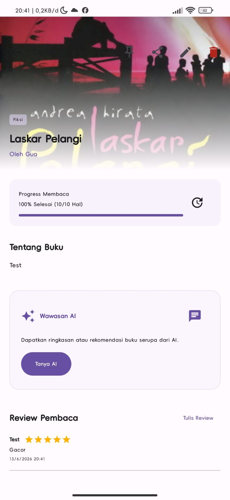
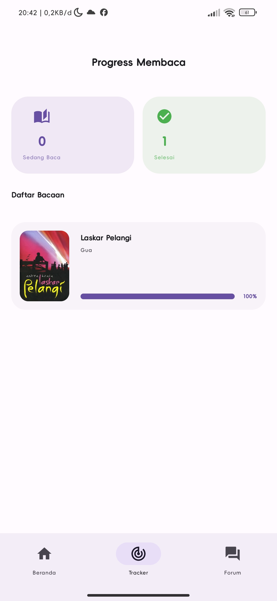
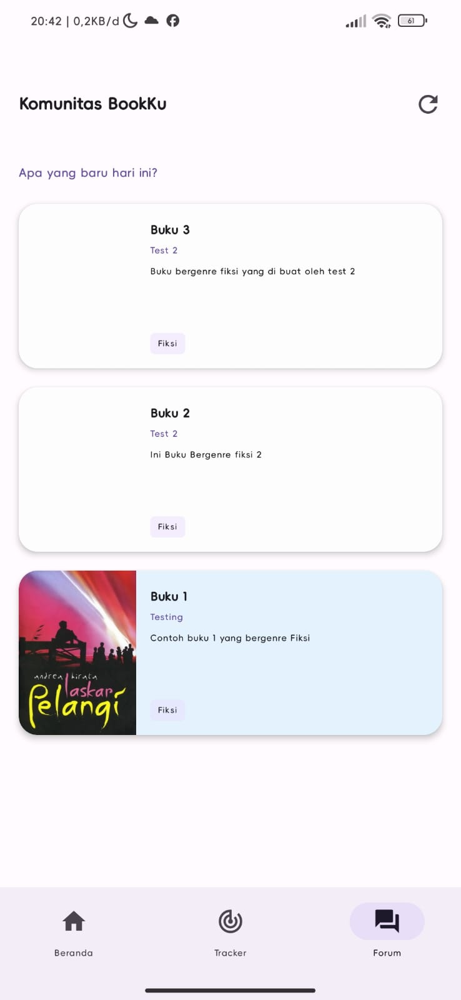

# BookKu - KMP Project

**BookKu** adalah aplikasi mobile komunitas membaca yang membantu pengguna menemukan, membagikan, dan mendiskusikan buku favorit mereka. Aplikasi ini menyediakan fitur rekomendasi buku berbasis AI, review dan rating, reading tracker, serta mini forum diskusi untuk meningkatkan minat baca dan membangun komunitas pembaca yang aktif.

## Tim
| Nama | NIM |
|-------|------------|
| Radja Apprilla | 123140084 |
| Gohan Tua Jeremia Ambarita | 123140160 |

## Gemini API Key
https://aistudio.google.com

## Fitur Aplikasi

- **Share Buku** - Pengguna dapat membagikan informasi buku seperti: judul, penulis, genre, deskripsi dan cover buku.
- **Review Rating** - Pengguna dapat memberikan rating, menulis review dan membaca pendapat orang lain.
- **AI Recommendation** - Sistem AI yang merekomendasikan buku berdasarkan: genre, rating dan minat pengguna
- **Reading Tracker** - Membantu pengguna dalam progress membaca, jumlah buku yang sudah di baca.
- **Mini Forum** - Ruang lingkup kecil komunitas untuk berdiskusi.
- **Search Filter** - Memudahkan pengguna mencari buku berdasarkan: genre, rating dan kategori lainnya.

## Arsitektur & Teknologi

Aplikasi ini berprinsip **Clean Architecture + MVVM**

## Tech Stack

| Layer | Technology |
|-------|------------|
| **UI** | Compose Multiplatform, Material 3 |
| **State** | StateFlow, ViewModel |
| **Navigation** | Compose Navigation (Type-safe) |
| **Networking** | Ktor Client |
| **Local DB** | SQLDelight |
| **Preferences** | DataStore |
| **DI** | Koin |
| **AI** | Google Gemini API |
| **Testing** | Kotlin Test, Turbine |

## Screenshoot APK
### Login

### Regis

### Home

### Detail

### Read

### Forum

## LINK YouTube:
https://youtu.be/NsNTsOFqH74?si=LuZnVKsiIwjRXxUG

## 👨‍🏫 Dosen Pengampu
### Pak Habib
[GitHub: mh4Scripts](https://github.com/mh4Scripts)

**Program Studi Teknik Informatika**  
Institut Teknologi Sumatera (ITERA)

